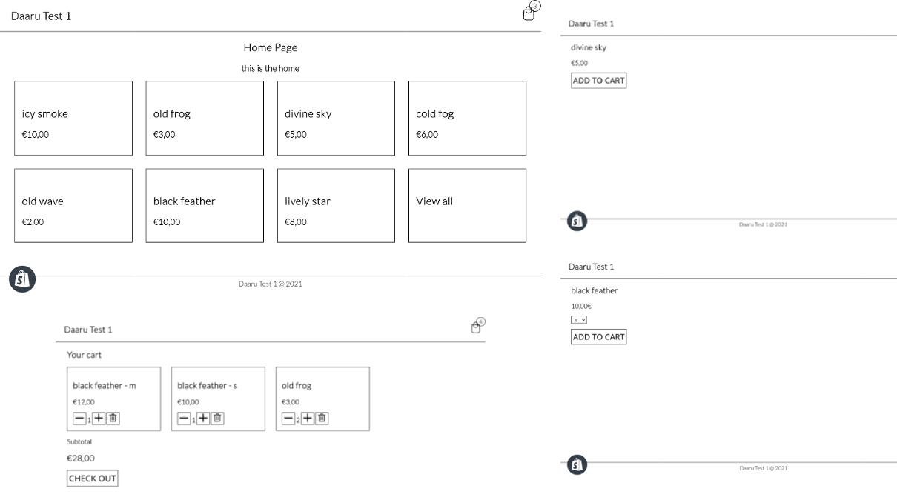
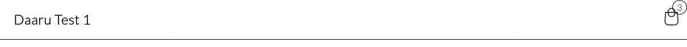
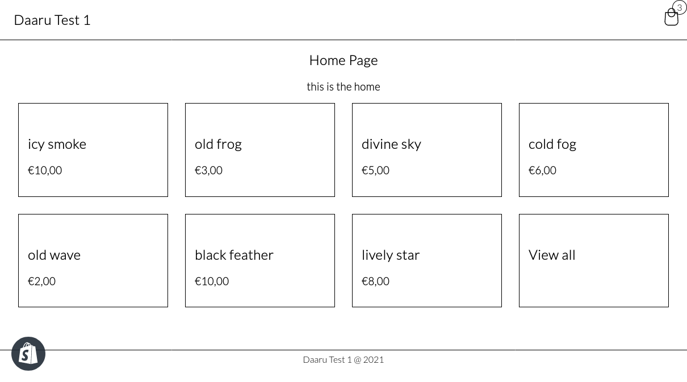
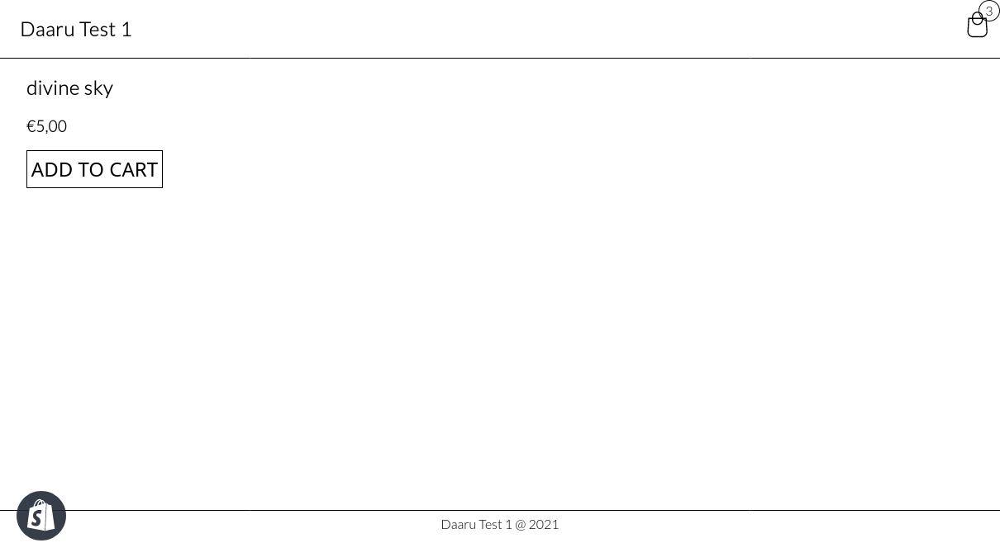
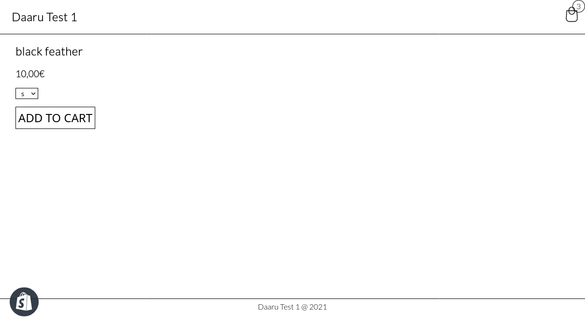
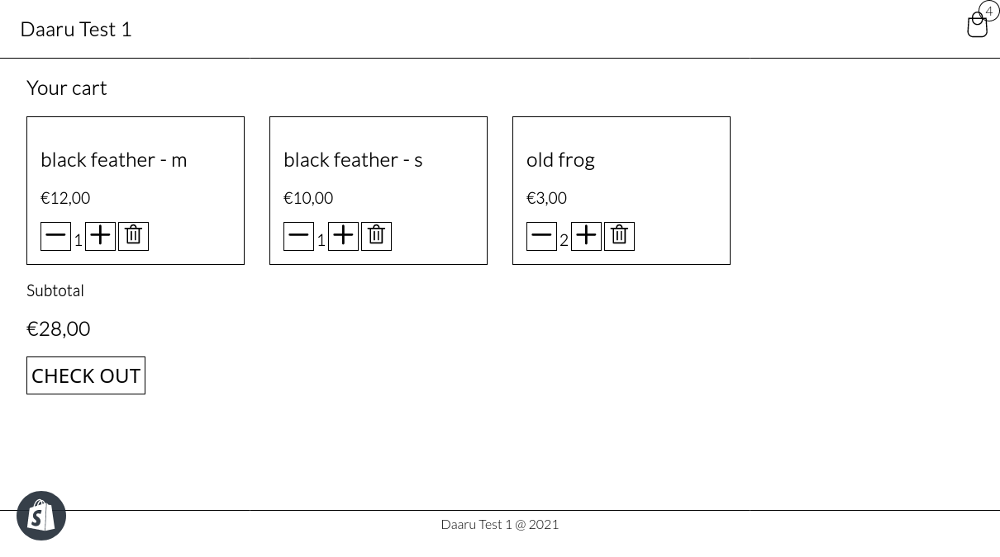

# Petite Vue Shopify Theme

This repository is an example that demonstrate how to use [Petite Vue](https://github.com/vuejs/petite-vue) in a [Shopify](https://www.shopify.com/) theme.



## Getting started

The deploy and development procedure use the [Shopify CLI](https://shopify.dev/themes/tools/cli/getting-started#preview-test-and-share-your-theme). If you haven't already, install and configure it.

Initialize a new theme based on this example (replace `<my theme name>` with the name of your theme):
```bash
shopify theme init <my theme name> --clone-url https://github.com/daaru00/shopify-theme-petite-vue.git
```

Use the `dev` command to upload theme as a development theme and watch for changes:
```bash
shopify theme dev
```

If not already logged you will be asked to login with verification code.

Made your changes or use the example as it is, when you're ready publish change to your live theme:
```bash
shopify theme push
```

You can also specify the store via '--store' arguments:
```bash
shopify theme push --store example.myshopify.com
```

More information about theme development can be found at the [official Shopify documentation](https://shopify.dev/themes/getting-started).

## Petite Vue integration

Petite Vue is super easy to include in the frontend using [JavaScript modules](https://developer.mozilla.org/en-US/docs/Web/JavaScript/Guide/Modules):
```html
<script type="module">
  import { createApp } from 'https://unpkg.com/petite-vue?module'
  createApp({
    // place here the root scope initialization
  }).mount("#page")
</script>
<section id="page">
  <!-- place here the template -->
</section>
```
this can be injected in any Shopify template page or sections without any other requirements.

### Template interpolation syntax collision

The [Liquid](https://shopify.dev/api/liquid) use the same syntax for variable interpolation as Vue, using something like this:
```html
<script type="module">
  import { createApp } from 'https://unpkg.com/petite-vue?module'
  createApp({
    test: 'example value'
  }).mount("#page")
</script>
<section id="page">
  <span>{{ test }}</span>
</section>
```
will not works because Shopify will replace `{{ test }}` on server side with an empty value (because does `test` not exist in server scope) and Petite Vue ends up with an empty template:
```html
<section id="page">
  <span></span>
</section>
```

There are two workaround for this:

1. Surround any Petite Vue template with Liquid `raw` tag, this will tells to Liquid to skip interpolation and left the html intact for the frontend:
```html

<section id="page">
  <span>{{ test }}</span>
</section>

```

2. Use `v-text` or `v-html` instead:
```html
<section id="page">
  <span v-text="test"></span>
</section>
```

### Sharing state between Liquid and Petite Vue

It is also possible to pass Liquid variable values to Petite Vue scope:
```html
<script type="module">
  import { createApp } from 'https://unpkg.com/petite-vue?module'

  createApp({
    product: JSON.parse('{{ product | json }}')
  }).mount("#page")
</script>
<section id="page">
  <h2 v-text="product.title"></h2>
  <h3 v-text="product.price"></h3>
</section>
```

Pay attention when you manage data in this way, the resulting HTML sent to the client will be without values:
```html
<section id="page">
  <h2 v-text="product.title"><!-- missing information --></h2>
  <h3 v-text="product.price"><!-- missing information --></h3>
</section>
```
..and this is not SEO friendly at all!

You can emulate something like a **"server side rendering and frontend side rehydration"** combining scope variable initialization with server side variable interpolation in the Petite Vue template:
```html
<script type="module">
  import { createApp } from 'https://unpkg.com/petite-vue?module'

  createApp({
    product: JSON.parse('{{ product | json }}')
  }).mount("#page")
</script>
<section id="page">
  <h2 v-text="product.title">{{ product.title }}</h2>
  <h3 v-text="product.price">{{ product.price }}</h3>
</section>
```

This will present to the client (especially for search crawlers) a template with already the values inside:
```html
<script type="module">
  import { createApp } from 'https://unpkg.com/petite-vue?module'

  createApp({
    product: JSON.parse('{{ product | json }}')
  }).mount("#page")
</script>
<section id="page">
  <h2 v-text="product.title">My Product Title</h2>
  <h3 v-text="product.price">$40</h3>
</section>
```

Obviously from this example there are no benefits to use Petite Vue in this way, but taking into consideration the product variants selected or various cart information the real benefit comes up.

## Reusable composable libraries

Some type of functionalities need to be included in different sections or simply reused across different pages. 

With the used approach when something (a class, an object, a method, a function or even a reactive state) need to be reused is describe is a separate file under `./assets` directory, for example `./assets/product.js`:
```js
import { reactive } from 'https://unpkg.com/petite-vue?module'

// shared reactive state
const store = reactive({
  product: {}
})

const useProduct = (productSerialized) => {
  Object.assign(store.product, JSON.parse(productSerialized || '{}'))

  const addToCart = () => {
    console.log(`Add product ${store.product.title} to cart`)
  }

  return {
    addToCart,
    get product() {
      return store.product
    }
  }
}

export { useProduct }
```
the library structure remand to [Vue 3 composition API](https://v3.vuejs.org/api/composition-api.html).

When used, the library is included via import statement pointing to remote file using Liquid interpolation for static assets file `{{ "<file name in assets directory>" | asset_url }}`:
```html
<script type="module">
  import { createApp } from 'https://unpkg.com/petite-vue?module'
  import { useProduct } from '{{ "product.js" | asset_url }}'

  const { product, addToCart } = useProduct('{{ product | json }}')

  createApp({
    product,
    addToCart
  }).mount("#page")
</script>
<section id="page">
  <h2 v-text="product.title">{{ product.title }}</h2>
  <h3 v-text="product.price">{{ product.price }}</h3>
  <button class="primary" @click="addToCart()">
    {{ 'products.product.add_to_cart' | t }}
  </button>
</section>
```

## Events

When two different Petite Vue app instances need to talk to each other they did it using an event-driven pattern. 

Events are sent using `dispatchEvent` browser API: 
```js
window.dispatchEvent(new CustomEvent('cartchanged', { 
  detail: {
    type: 'add',
    id: 'xxxxxxx',
    quantity: 5
  } 
}));
```
and received attaching listeners:
```js
window.addEventListener('cartchanged', ({ detail }) => {
  console.log('cart changed!', detail)
});
```

This approach allows different applications to be able to execute actions to each other, in some situations it's just a little bit more comfortable then using `v-effect` approach.

## Implemented Shopify functionalities

Just a few Shopify theme page are implemented: home, products list, product and cart page. 

### Header

In the header top bar the cart icon's badge indicate the number of product in the cart.



This is made using Petite Vue reactive: when executing operation against the cart, using the `useCart` composable library, the `cart` variable exported change:
```js
import { createApp } from 'https://unpkg.com/petite-vue?module'
import { useCart } from '{{ "cart.js" | asset_url }}'

const { cart } = useCart('{{ cart | json }}')

createApp({
  cart,
  get isCartEmpty() {
    return cart.item_count === 0
  }
}).mount("#shopify-section-header")
```
```html
<a class="cart-icon" v-cloak href="{{ routes.cart_url }}">

  <i v-if="!cart.loading && isCartEmpty">
    
  </i>
  <i v-else-if="!cart.loading && !isCartEmpty">
    
  </i>
  <span v-else-if="cart.loading">
    ..
  </span>

  <span class="bubble" v-if="cart.item_count > 0" v-text="cart.item_count"></span>
</a>
```

### Home

The home page is really simple and just implements a products grid (`./sections/products-list.liquid`).



### Simple product

The product page just show basic product information like name and price:
```html
<h1>{{ product.title }}</h1>


  <h3>{{ product.price | money }}</h3>

```



### Product with variants

For products with variants it render the products variants selector:
```html

  <h3 v-text="formatPrice(variant.price)">{{ product.selected_or_first_available_variant.price | money }}</h3>

  <p>
    <select v-model="variant" v-effect="onVariantSelected(variant)">
      <option
        v-for="variant in product.variants" 
        :key="variant.id"  
        :value="variant"
        v-text="variant.title">
      </option>
    </select>
  </p>

```



The price will be displayed according to the variant selected, in order to do that the `useProduct` composable library is initialized with the product and current variant data:
```js
import { useProduct } from '{{ "product.js" | asset_url }}'

const { product, variant, updateVariantQueryParam } = useProduct('{{ product | json }}', '{{ product.selected_or_first_available_variant.id }}')
```
Current variant information, contained in the exported `variant` variable, is binded using `v-model="variant"` with select's value. This in order to correctly load the current variant on page load.

When a new variant is selected (binded with `v-model="variant"` to variant scope variable) the `onVariantSelected` method will be triggered thanks to Petite Vue `v-effect` directive.

The variable change is propagated to query parameters (in case the user will reload the page or use a pre-crafted url for a specific variable selection) using `updateVariantQueryParam` method exported by `useProduct` composable library.
```js
import { createApp, reactive } from 'https://unpkg.com/petite-vue?module'

createApp({
  // ...
  onVariantSelected(variant) {
    updateVariantQueryParam(variant.id)
    window.dispatchEvent(new CustomEvent('variantchanged', { detail: variant }));
  }
  // ...
}).mount('#page')
```
```html
<select v-model="variant" v-effect="onVariantSelected(variant)">
  <option
    v-for="variant in product.variants" 
    :key="variant.id"  
    :value="variant"
    v-text="variant.title">
  </option>
</select>
```

### Cart

The cart page list all items in cart and implements quantity change and delete functionality.



It also blocks other cart operations when one is already in progress:
```html
<script type="module">
  import { createApp, reactive } from 'https://unpkg.com/petite-vue?module'
  import { useCart } from '{{ "cart.js" | asset_url }}'

  const { cart, updateVariantCartQuantity } = useCart()

  createApp({
    cart,
    async updateQuantity(item, quantity) {
      console.log('updating..', item.variant_id, quantity)
      await updateVariantCartQuantity(item.variant_id, quantity)
      console.log('updating!', item.variant_id, quantity)
    },
  }).mount('#page')
</script>
<section id="page">
  <button type="button" :disabled="cart.loading" @click="updateQuantity(item, item.quantity - 1)">
    
  </button>
</section>
```

The `cart.loading` flag is centrally controlled by `useCart` composable library:
```js
import { reactive } from 'https://unpkg.com/petite-vue?module'

const cart = reactive({
  loading: false
})

const useCart = () => {

  const updateVariantCartQuantity = async (id, quantity) => {
    cart.loading = true

    // update cart

    cart.loading = false
  }

  return {
    cart,
    updateVariantCartQuantity
  }
}

export { useCart }
```

## Considerations

Is this suitable for a production/live environment? Yes! It works pretty well, but the Petite Vue repository's disclaimer scares a little:

> This is pretty new. There are probably bugs and there might still be API changes, so use at your own risk. Is it usable though? Very much.

Petite Vue is really small (~6kb) and does not affect so much the page load, in fact quite nothing.

Vanilla JavaScript is cool, ok, but with Petite Vue some functionalities like one/two way binding, reactive state, components managements are already available.

In a simple Shopify theme, frontend reactive it's not mandatory, in fact the Shopify default theme [dawn](https://themes.shopify.com/themes/dawn/styles/default) can works without JavaScript enabled in the browser. In case it is necessary to implement something dynamic on the frontend side, to increase the user clutter or improve the UX, this solution could be more than valid.
